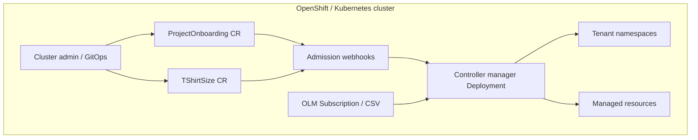

# Architecture

High-level view of **project-onboarding-operator** components and data flow.

## Components

| Component | Location | Role |
|-----------|----------|------|
| **API** | `api/v1beta1` | CRD schemas |
| **Controllers** | `internal/controller/` | Watch CRs, enqueue reconcile |
| **Reconcile engine** | `internal/onboarding/` | Create/patch/prune namespaces, quotas, policies, RBAC, GitOps, OpenShift types |
| **Webhooks** | `internal/webhook/`, `internal/validation/` | Validate CRs at admission |
| **Manager** | `cmd/main.go` | Leader election, metrics :8443, webhook server |
| **OLM bundle** | `bundle/` | CSV, CRDs, RBAC, ServiceMonitor, PrometheusRule |

## Reconcile flow

1. User creates or updates a `ProjectOnboarding` (cluster-scoped).
2. Validating webhook checks references (`projectSize` → `TShirtSize`, duplicate namespace names).
3. `ProjectOnboardingReconciler` loads the CR and calls `internal/onboarding.Reconcile`.
4. For each `spec.namespaces[]` entry:
   - Create or patch tenant `Namespace` (labels, PSA, monitoring, Argo CD annotations).
   - Apply `ResourceQuota`, `LimitRange`, `NetworkPolicy`, `RoleBinding`, OpenShift `Group` / `EgressIP` as configured.
   - Optional Argo CD `AppProject` resources.
5. Status conditions and Prometheus metrics are updated.
6. On delete: finalizer blocks until namespaces are offboarded or removed.

`TShirtSize` reconciler maintains catalogue objects; delete is blocked while referenced.

## Deployment modes

| Mode | Install | Catalog location |
|------|---------|------------------|
| **operator-sdk** | `operator-sdk run bundle` | `project-onboarding-operator` namespace |
| **OperatorHub** | CatalogSource + Subscription | `openshift-marketplace` |

See [install.md](install.md) and [upgrade.md](upgrade.md).

## High availability

- OLM CSV deploys **3 replicas** with leader election (`config/manager/manager.yaml`).
- PodDisruptionBudget limits voluntary disruption.
- Webhook and metrics traffic target the Service fronting all replicas; only the leader runs controllers.

## Observability

| Signal | Source |
|--------|--------|
| Custom metrics | `projectonboarding_tenants_total`, `projectonboarding_reconcile_errors_total{reason}` |
| Controller-runtime metrics | Reconcile latency, workqueue depth, errors |
| Alerts | `PrometheusRule` in bundle (`config/prometheus/rules.yaml`) |
| Dashboard | [grafana/dashboard.json](grafana/dashboard.json) |

Metrics use controller-runtime TLS on port **8443**. The default OLM bundle sets `insecureSkipVerify: true` on the ServiceMonitor (self-signed certs). For strict TLS, use overlay `config/overlays/metrics-tls/` with cert-manager (non-OLM / `make deploy` flows).

## Supply chain

- Multi-stage build: Red Hat Hardened Images (`build/hi-images.lock`, `hack/resolve-hi-digests.sh`).
- Release images signed with cosign; SPDX SBOM and SLSA provenance attached ([supply-chain.md](supply-chain.md)).
- Git bundle uses semver image tags; **published** bundle images pin the operator deployment to `@sha256` digests at release time.

## Related docs

- [api-design.md](api-design.md) — API stability and versioning
- [runbook.md](runbook.md) — incidents and upgrades
- [metrics.md](metrics.md) — scraping and alerts
