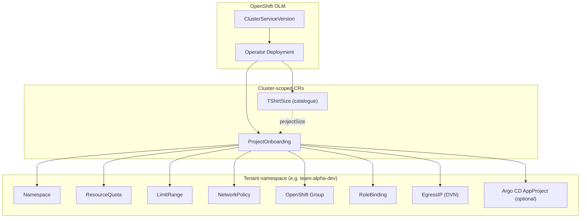

# Project Onboarding Operator — User guide

An overview of console form fields and YAML references for `ProjectOnboarding` and `TShirtSize` on OpenShift.

---

## What the operator does on OpenShift

The operator is installed **once** cluster-wide. It runs in the `project-onboarding-operator` namespace as `project-onboarding-operator-controller-manager`.

You then create **cluster-scoped** custom resources **ProjectOnboarding**. For each entry in `spec.namespaces[]`, the operator reconciles OpenShift and Kubernetes objects in the **tenant** namespace (`spec.namespaces[].name`).




| Layer      | OpenShift object                                                | Purpose                                                          |
| ---------- | --------------------------------------------------------------- | ---------------------------------------------------------------- |
| Install    | `Subscription` / `ClusterServiceVersion`                        | Delivers the operator Deployment, CRDs, webhooks, RBAC           |
| Catalogue  | `TShirtSize` (`tshirtsizes.onboarding.stderr.at`)               | Optional preset sizes (quota / limit range templates)            |
| Onboarding | `ProjectOnboarding` (`projectonboardings.onboarding.stderr.at`) | Declares one or more tenant namespaces and their platform config |
| Tenant     | `Namespace`, `ResourceQuota`, …                                 | Created and kept in sync by the operator                         |


**Short names:** `oc get pob` (ProjectOnboarding), `oc get tts` (TShirtSize).

---

## Prerequisites


| Requirement                    | Notes                                                            |
| ------------------------------ | ---------------------------------------------------------------- |
| OpenShift 4.15+                | OVN-Kubernetes required for **EgressIP**                         |
| Cluster-admin (install)        | OLM install, CRD install, webhooks                               |
| Argo CD CRD (optional)         | `appprojects.argoproj.io` for GitOps `AppProject` reconciliation |
| Prometheus Operator (optional) | For bundled `ServiceMonitor` / `PrometheusRule` — see [metrics.md](metrics.md) |


---

## Installing the operator

Choose one path:


| Path                                | Guide                                            |
| ----------------------------------- | ------------------------------------------------ |
| OperatorHub (UI) + custom catalog   | [operatorhub-install.md](operatorhub-install.md) |
| OLM CLI (`operator-sdk run bundle`) | [openshift-install.md](openshift-install.md)     |


After install, verify:

```bash
export OPERATOR_NS=project-onboarding-operator

oc get csv -n "${OPERATOR_NS}"
oc get pods -n "${OPERATOR_NS}" -l control-plane=controller-manager
oc api-resources | grep -E 'projectonboarding|tshirtsize'
```

---

## Custom resources overview

Both CRs are **cluster-scoped** (not namespaced). The CR `metadata.name` is the resource name; the **tenant** namespace is always `spec.namespaces[].name`.


| CRD                 | API group              | Storage version | OpenShift console                                                                   |
| ------------------- | ---------------------- | --------------- | ----------------------------------------------------------------------------------- |
| `ProjectOnboarding` | `onboarding.stderr.at` | `v1beta1`       | **Operators → Installed Operators → Project Onboarding → Create ProjectOnboarding** |
| `TShirtSize`        | `onboarding.stderr.at` | `v1beta1`       | Same operator tile → **TShirt Size**                                                |


`v1alpha1` is still served; use `v1beta1` for new manifests. Conversion runs in the operator webhook ([api-design.md](api-design.md)).

---

## Configuring `TShirtSize` (catalogue)

A `TShirtSize` defines reusable **ResourceQuota** and **LimitRange** presets. Reference it from `ProjectOnboarding` via `spec.namespaces[].projectSize` so platform teams govern capacity once and tenants pick a size name instead of quota keys.

Typical workflow:

1. Create catalogue entries cluster-wide (`small`, `large`, …).
2. Reference `projectSize: small` (or another name) on namespace entries.
3. Optionally set `overwriteTshirt: true` to merge inline overrides.

See [project-size.md](project-size.md) for merge rules and validation. For why T-shirt sizing exists and how it fits onboarding, see [T-shirt sizing](#t-shirt-sizing-projectsize--overwritetshirt) below.

Sample catalogue: `config/samples/onboarding_v1beta1_tshirtsizes_catalog.yaml`

---

## Configuring `ProjectOnboarding`

A single `ProjectOnboarding` can onboard **multiple** tenant namespaces via `spec.namespaces[]` (max 64 entries). Each entry is independent (enable/offboard, sizing, policies, …).

### Resource relationship

```
ProjectOnboarding (cluster)
└── spec.namespaces[]
    ├── name                    → tenant Namespace name (required)
    ├── enabled                 → reconciliation on/off (freeze when false)
    ├── offboard                → tear down and delete tenant namespace
    ├── additionalSettings      → Pod Security, monitoring, custom labels
    ├── projectSize             → TShirtSize reference
    ├── overwriteTshirt         → merge inline quota/limits onto T-shirt
    ├── resourceQuotas          → ResourceQuota in tenant namespace
    ├── limitRanges             → LimitRange in tenant namespace
    ├── defaultPolicies         → built-in NetworkPolicy set
    ├── networkPolicies         → custom NetworkPolicies
    ├── localAdminGroup         → OpenShift Group + RoleBinding
    ├── egressIPs                 → OVN EgressIP (OpenShift)
    ├── applicationGitOpsNamespace → Argo CD instance namespace (per tenant entry)
    └── argoCDProjects          → Argo CD AppProject
```

### Basic onboarding

Creates a tenant namespace with quotas, limits, and default network policies.

Sample: `config/samples/onboarding_v1beta1_projectonboarding.yaml`

---

### Namespace entry settings

Each `spec.namespaces[]` row controls one tenant namespace: lifecycle (`enabled`, `offboard`), plus `additionalSettings` for Pod Security, monitoring, and custom labels. The table maps YAML fields to the OpenShift operator form and cluster effect.


| YAML field                                   | Console control                           | Effect / notes                                                                                                                                                                                                                                                                                                                                                                             |
| -------------------------------------------- | ----------------------------------------- | ------------------------------------------------------------------------------------------------------------------------------------------------------------------------------------------------------------------------------------------------------------------------------------------------------------------------------------------------------------------------------------------ |
| `enabled`                                    | **Reconciliation Enabled**                | Default `true`. When `false`, the operator **freezes** the entry: no updates and no teardown. Independent of offboard.                                                                                                                                                                                                                                                                     |
| `offboard`                                   | **Offboard**                              | Default `false` (opt-in). When `true`, the operator removes managed resources (quotas, network policies, GitOps AppProjects, Groups, EgressIPs, …) and **deletes** the tenant namespace including remaining workloads. Use this to tear down a tenant while keeping the `ProjectOnboarding` CR, or to unblock CR deletion (see [Lifecycle](#lifecycle-enable-freeze-offboard-and-delete)). |
| `additionalSettings.podSecurityEnforce`      | **Pod Security Enforce**                  | Sets `pod-security.kubernetes.io/enforce`. Blocks pods that violate the profile (`privileged`, `baseline`, or `restricted`).                                                                                                                                                                                                                                                               |
| `additionalSettings.podSecurityWarn`         | **Pod Security Warn**                     | Sets `pod-security.kubernetes.io/warn`. Admits pods but returns a warning when the profile is violated. Often set one level looser than enforce during migration.                                                                                                                                                                                                                          |
| `additionalSettings.podSecurityAudit`        | **Pod Security Audit**                    | Sets `pod-security.kubernetes.io/audit`. Records violations in the audit log without blocking or warning.                                                                                                                                                                                                                                                                                  |
| `additionalSettings.enableClusterMonitoring` | **User Workload Monitoring**              | Default `true`. Sets `openshift.io/user-monitoring` on the tenant namespace so user-workload Prometheus can scrape workloads. Uncheck (set `false`) to opt out (`openshift.io/user-monitoring=false`).                                                                                                                                                                                     |
| `additionalSettings.additionalLabels`        | **Custom Namespace Labels** → Key / Value | List of `{ key, value }` pairs on the tenant namespace. Use **Add label** in the form; no defaults are pre-filled. Quote numeric-looking values (e.g. `'150'`). Operator-managed labels win on key conflicts (onboarding, pod security, monitoring, `namespace-size`).                                                                                                                     |


Example — Pod Security **restricted** on enforce/warn/audit, user workload monitoring on, and labels `team`, `costcenter`, `project`:

```yaml
spec:
  namespaces:
  ...
    - name: tenant1
      enabled: true
      offboard: false
      additionalSettings:
        additionalLabels:
          - key: team
            value: payments
        podSecurityAudit: restricted
        podSecurityEnforce: restricted
        podSecurityWarn: restricted
```

The Namespace object that will be created looks like:

```yaml
kind: Namespace
apiVersion: v1
metadata:
  name: tenant1
  labels:
    pod-security.kubernetes.io/warn: restricted
    pod-security.kubernetes.io/audit: restricted
    openshift.io/user-monitoring: 'true'
    pod-security.kubernetes.io/enforce: restricted
    team: payments
```

---

### Resource quotas

When `resourceQuotas.enabled` is true, the operator creates or updates a `ResourceQuota` object in the tenant namespace. Values can come from a T-shirt catalogue or from inline spec. In the OpenShift form fill in only what you need.


| Field group      | Purpose                                                                                                     |
| ---------------- | ----------------------------------------------------------------------------------------------------------- |
| Top-level counts | Object limits (`pods`, `services`, `secrets`, …) and aggregate quotas (`cpu`, `memory`, `ephemeralStorage`) |
| `limits`         | Cluster-wide `limits.`* keys (sum of container limits)                                                      |
| `requests`       | Cluster-wide `requests.`* keys (sum of container/PVC requests)                                              |
| `storageClasses` | List of `{ key, value }` StorageClass quota keys (**Add** in the operator form)                             |


Quantity fields use [Kubernetes resource notation](https://kubernetes.io/docs/reference/kubernetes-api/common-definitions/quantity/). The validating webhook rejects memory and storage values without a unit suffix (plain `4` means **bytes**, not 4 GiB).


| Field kind                            | Enter                 | Example                                                                  | Plain integer `4` means                |
| ------------------------------------- | --------------------- | ------------------------------------------------------------------------ | -------------------------------------- |
| **CPU**                               | Cores or millicores   | `4`, `4000m`, `500m`                                                     | 4 CPU cores                            |
| **Memory**                            | Value **with** suffix | `4Gi`, `500Mi`, `2G`                                                     | Plain 4 would be rejected at admission |
| **Ephemeral storage**                 | Value **with** suffix | `4Gi`, `4Mi`                                                             | Plain 4 would be rejected at admission |
| **Storage** (PVC / requests.storage)  | Value **with** suffix | `50Gi`, `1Gi`, `20Gi`                                                    | Plain 4 would be rejected at admission |
| **Object counts** (pods, services, …) | Whole number          | `4`, `10`                                                                | 4 objects                              |
| **StorageClasses → value**            | Depends on key        | `10Gi` for `.../requests.storage`; `10` for `.../persistentvolumeclaims` | Count keys only                        |


Lower-case suffixes such as `4gi` or `500mi` are normalized to `Gi` / `Mi` at reconcile time. Prefer **`projectSize`** (T-shirt catalogue) when tenants should pick a preset instead of typing quantities.

**Test admission (should fail):**

Full Example — Resource Quota definition:

**NOTE:** Only fill what you need; leave settings you do not want to quota empty.

```yaml
spec:
  namespaces:
  ...
    resourceQuotas:
      enabled: true
      cpu: "4"
      memory: 4Gi
      ephemeralStorage: 4Gi
      pods: 4
      replicationControllers: 20
      resourceQuotas: 20
      services: 100
      secrets: 100
      configMaps: 100
      persistentVolumeClaims: 10
      limits:
        cpu: "4"
        memory: 4gi   # lower case will be automatically replaced
        ephemeralStorage: 4mi
      requests:
        cpu: "1"
        memory: 2Gi
        storage: 50Gi
        ephemeralStorage: 2Gi
      storageClasses:
        - key: bronze.storageclass.storage.k8s.io/requests.storage
          value: "10Gi"
        - key: bronze.storageclass.storage.k8s.io/persistentvolumeclaims
          value: "10"
```

This would create a ResourceQuota object in the tenant namespace:

```yaml
kind: ResourceQuota
apiVersion: v1
metadata:
  name: tenant1-quota
  namespace: tenant1
spec:
  hard:
    memory: 8Gi
    requests.ephemeral-storage: 2Gi
    bronze.storageclass.storage.k8s.io/requests.storage: 50Gi
    secrets: '100'
    cpu: '4'
    persistentvolumeclaims: '100'
    resourcequotas: '100'
    replicationcontrollers: '100'
    ephemeral-storage: 50Mi
    requests.memory: 2Gi
    pods: '100'
    requests.storage: 50Gi
    limits.cpu: '4'
    limits.ephemeral-storage: 4Gi
    limits.memory: 4Gi
    configmaps: '100'
    bronze.storageclass.storage.k8s.io/persistentvolumeclaims: '10'
    services: '100'
    requests.cpu: '1'
```

You do not need to define every setting here. Fill only the settings you actually need.

Small Example — Resource Quota definition, only sets cpu and memory limit:

```yaml
spec:
  namespaces:
  ...
    resourceQuotas:
      enabled: true
      cpu: "4"
      memory: 4Gi
```

---

### Limit ranges

When `limitRanges.enabled` is true, the operator creates or updates a `LimitRange` object in the tenant namespace. The form groups settings by **Pod**, **Container**, and **PVC** limit types. **Enabled** starts deselected with empty fields.


| Section     | Purpose                                                     |
| ----------- | ----------------------------------------------------------- |
| `pod`       | Min/max CPU and memory for the sum of containers in a pod   |
| `container` | Per-container min/max, default limits, and default requests |
| `pvc`       | Min/max storage for PersistentVolumeClaims                  |


```yaml
limitRanges:
  enabled: true
  pod:
    max:
      cpu: "4"
      memory: 4Gi
    min:
      cpu: 500m
      memory: 500Mi
  container:
    max:
      cpu: "4"
      memory: 4Gi
    min:
      cpu: 500m
      memory: 500Mi
    default:
      cpu: "1"
      memory: 4Gi
    defaultRequest:
      cpu: "1"
      memory: 2Gi
  pvc:
    min:
      storage: 1Gi
    max:
      storage: 20Gi
```

---

### Default network policies (`defaultPolicies`)

**Default policies** are opt-in toggles for a standard NetworkPolicy set. All switches start off in the form. A typical hardened setup turns on the allow rules below plus deny-all ingress/egress so only listed traffic is permitted.

**NOTE:** Network policies are managed by namespace administrators by default. Setting them here is one option; another is to leave this to the namespace owner. As a cluster administrator, use `AdminNetworkPolicies` instead.


| Toggle                   | NetworkPolicy created                | Purpose                                                                           |
| ------------------------ | ------------------------------------ | --------------------------------------------------------------------------------- |
| `allowFromIngress`       | `allow-from-openshift-ingress`       | Ingress from the OpenShift router (public Routes)                                 |
| `allowFromMonitoring`    | `allow-from-openshift-monitoring`    | Ingress from platform Prometheus (`openshift-monitoring`)                         |
| `allowKubeAPIServer`     | `allow-from-kube-apiserver-operator` | Ingress from kube-apiserver operator probes                                       |
| `allowToDNS`             | `allow-to-openshift-dns`             | Egress to `openshift-dns` (ports 53/5353 TCP/UDP)                                 |
| `allowFromSameNamespace` | `allow-same-namespace`               | Pod-to-pod ingress within the tenant namespace                                    |
| `denyAllEgress`          | `deny-all-egress`                    | Default-deny egress (pair with explicit allows such as DNS)                       |
| `denyAllIngress`         | `deny-all-ingress`                   | Default-deny ingress (pair with explicit allows such as router or same-namespace) |


Omit `defaultPolicies` or leave all toggles off to install **no** default NetworkPolicies. Use `networkPolicies[]` for additional custom rules.

#### Default network policies (console form)

Form example: all default policy toggles on, including deny-all ingress and egress.

```yaml
spec:
  namespaces:
    - name: tenant-a
      defaultPolicies:
        allowFromIngress: true
        allowFromMonitoring: true
        allowKubeAPIServer: true
        allowToDNS: true
        allowFromSameNamespace: true
        denyAllEgress: true
        denyAllIngress: true
```

**Custom policies** (`networkPolicies`): Additional `NetworkPolicy` manifests per namespace entry, reconciled alongside the default set.

### Local administrators (`localAdminGroup`)

When `localAdminGroup.enabled` is true, the operator creates an OpenShift **Group** (`user.openshift.io/v1`) and a namespace **RoleBinding** to a cluster role (defaults to `admin` when `clusterRole` is omitted). This gives named OpenShift users administrative access to the tenant namespace through group membership.

**NOTE** This is useful if you manage the groups inside OpenShift. However, in many cases such groups are actually managed by external systems like LDAP or Active Directory.


| YAML field    | Console control      | Notes                                                      |
| ------------- | -------------------- | ---------------------------------------------------------- |
| `enabled`     | **Enabled** (opt-in) | Unchecked by default; **Users** are required when enabled. |
| `clusterRole` | **Cluster Role**     | e.g. `admin` or `edit`; no form default.                   |
| `groupName`   | **Group Name**       | Defaults to `<namespace>-admins` when omitted.             |
| `users`       | **Users**            | OpenShift user names added to the Group.                   |


#### Namespace admins (console form)

Form example: namespace admins enabled, cluster role `admin`, group `tenant-1-admins`, user `developer1`.

```yaml
spec:
  namespaces:
    - name: tenant-a
      localAdminGroup:
        enabled: true
        users:
          - developer1
        clusterRole: admin
        groupName: tenant-1-admins
```

Verify after reconcile:

```bash
oc get group tenant-1-admins -o yaml
oc get rolebinding -n tenant-a
```

### OpenShift networking — EgressIP

Requires **OVN-Kubernetes**. When `egressIPs.enabled` is true, the operator creates an `EgressIP` object.

You can define multiple IP addresses if you like:

```yaml
      egressIPs:
        enabled: true
        ips:
          - 192.168.0.1
```

**NOTE** The nodes must be prepared beforehand with a special label, otherwise the IP address cannot be assigned to any node. 

---

### GitOps / Argo CD

GitOps integration prepares the Argo CD instance for each tenant. The operator creates `AppProject` resources in the Argo CD namespace you select per namespace entry.

**Cluster-wide defaults** (`allowedSourceRepos`, `allowedOIDCGroups`, `destinations`, legacy `applicationNamespace`) are **not** in the OpenShift form. Configure them once via the `onboarding-defaults` ConfigMap or `spec.gitOps` in YAML — see [cluster-defaults.md](cluster-defaults.md) for format, merge rules, and troubleshooting. Per-tenant GitOps uses `applicationGitOpsNamespace` and `argoCDProjects[]` below.

#### Application GitOps namespace (per tenant entry)


| Field Name                     | Operator field                                 |
| ------------------------------ | ---------------------------------------------- |
| `application_gitops_namespace` | `spec.namespaces[].applicationGitOpsNamespace` |


This selects the namespace where the Argo CD instance is running, which should be configured for the tenant. For example, if the Argo CD instance is running in the namespace `gitops-application` then you configure this namespace.

**Note**: Do not use the default namespace `openshift-gitops` as this instance has special permissions to manage the cluster itself. 

```yaml
spec:
  namespaces:
    - name: tenant1
      applicationGitOpsNamespace: gitops-application
```

### Argo CD Project

When GitOps is enabled on a namespace entry, the operator can create an `AppProject` resource in the **application GitOps namespace** (`applicationGitOpsNamespace`). An AppProject is Argo CD’s tenant boundary: it defines **where** Applications may deploy, **which Git repos** are allowed, **which namespaces** may host Application CRs, and **who** (OIDC groups) may perform **which actions** via project-scoped RBAC roles.

The OpenShift form exposes this as **Argo CD Project** (opt-in **Enabled** per project). Per-project overrides use fields on `argoCDProjects[]`; unset fields inherit from [cluster defaults](cluster-defaults.md).

The operator also labels the **tenant OpenShift namespace** with `argocd.argoproj.io/managed-by: <applicationGitOpsNamespace>` so Argo CD knows which instance owns that namespace.

#### What the operator renders

For each `argoCDProjects[]` entry with `enabled: true`:

1. Creates/updates `AppProject` in `applicationGitOpsNamespace` (`metadata.name` = **Project Name**).
2. Sets `spec.destinations` — for example in-cluster, to define which clusters the tenant has access to deploy the application.
3. Sets `spec.sourceRepos` and `spec.sourceNamespaces` from project overrides or cluster `gitOps` defaults.
4. Builds `spec.roles[]` with OIDC **groups** and Casbin **policies** (see below).

**Project Name** should match `spec.namespaces[].name` when possible so Argo CD RBAC (`proj:<name>:<role>`) aligns with OIDC group bindings. See sample below.

#### Field reference (`argoCDProjects[]`)


| Field              | Purpose                                                                                              |
| ------------------ | ---------------------------------------------------------------------------------------------------- |
| `enabled`          | Opt-in. No AppProject is created until `true`.                                                       |
| `name`             | AppProject `metadata.name` and application path prefix in policies (`<name>/<app>`).                 |
| `description`      | Shown in Argo CD UI; defaults to `<name> GitOps Project`.                                            |
| `sourceRepos`      | Overrides cluster `gitOps.allowedSourceRepos` for this project.                                      |
| `sourceNamespaces` | Overrides `gitOps.allowedSourceNamespaces` (where Application CRs may live). Default `*` when unset. |
| `destinations`     | Overrides cluster `gitOps.destinations`; tenant **namespace** is always injected per destination.    |
| `oidcGroups`       | Default OIDC groups for all roles in this project (unless a role overrides).                         |
| `roles`            | AppProject RBAC roles (see next section).                                                            |


#### Roles, policies, and permissions

Each **role** becomes one Argo CD project role with:

- `name` — role identifier (e.g. `write`, `read`).
- `description` — UI text.
- `oidcGroups` — OpenShift/LDAP groups allowed to use this role (overrides project-level and cluster `allowedOIDCGroups`).
- `fullAccess` **or** `policies` — mutually exclusive styles (see below).

**Granular policies** (`policies[]`) — one Casbin line per entry:


| Policy field     | Meaning                                                                                         |
| ---------------- | ----------------------------------------------------------------------------------------------- |
| `resource`       | Usually `applications` or `repositories`.                                                       |
| `action`         | Argo CD action: `get`, `create`, `update`, `delete`, `sync`, `override`, …                      |
| `object`         | Application path within the project (default `*` = all apps in the project).                    |
| `permission`     | `allow` or `deny`.                                                                              |
| `appProjectName` | Optional override for the `proj:` prefix in Casbin (advanced; default = tenant namespace name). |


The operator generates policies like:

```text
p, proj:<tenant-ns>:<role>, <resource>, <action>, <project-name>/<object>, <permission>
```

Example: `p, proj:tenant1-app-1:write, applications, sync, tenant1-app-1/*, allow` allows the `write` role to sync any Application in project `tenant1-app-1`.

**OIDC group resolution** (first match wins): `roles[].oidcGroups` → `argoCDProjects[].oidcGroups` → `gitOps.allowedOIDCGroups` → `dummy-group` (placeholder if nothing is configured).

#### `fullAccess: true`

When `fullAccess` is enabled on a role, the operator **does not** read `policies[]`. It emits a fixed set of **allow** policies:

- All application actions on `project-name/`*: `get`, `create`, `update`, `delete`, `sync`, `override`.
- All repository actions cluster-wide for that role: `create`, `get`, `update`, `delete` on `*`.

Any `policies` on the same role are ignored when `fullAccess` is true.

#### Example: tenant1 (`ProjectOnboarding`)

```yaml
apiVersion: onboarding.stderr.at/v1beta1
kind: ProjectOnboarding
metadata:
  name: tenant1-onboarding
spec:
  namespaces:
    - name: tenant1-app-1
      enabled: true
      applicationGitOpsNamespace: gitops-application
      argoCDProjects:
        # AppProject tenant1-app-1 — granular write + read-only roles
        - name: tenant1-app-1
          enabled: true
          sourceRepos:
            - https://my-git-repo.com/super-repo
          sourceNamespaces:
            - '*'
          destinations:
            - name: in-cluster
              server: https://kubernetes.default.svc
          roles:
            - name: write
              description: Group to deploy on target environments
              oidcGroups:
                - admin-group-1
                - admin-group-2
              policies:
                - resource: applications
                  action: get
                  permission: allow
                  object: "*"
                - resource: applications
                  action: create
                  permission: allow
                - resource: applications
                  action: update
                  permission: allow
                - resource: applications
                  action: delete
                  permission: allow
                - resource: applications
                  action: sync
                  permission: allow
                - resource: applications
                  action: override
                  permission: allow
            - name: read
              description: Read-only access
              oidcGroups:
                - read-group
              policies:
                - resource: applications
                  action: get
                  permission: allow
```

#### Example: rendered `AppProject` (`tenant1-app-1`)

After reconcile, the operator creates this resource in namespace `gitops-application` (labels shortened; operator adds standard onboarding labels):

```yaml
apiVersion: argoproj.io/v1alpha1
kind: AppProject
metadata:
  name: tenant1-app-1
  namespace: gitops-application
  annotations:
    argocd.argoproj.io/sync-wave: "1"
  labels:
    app.kubernetes.io/managed-by: project-onboarding-operator
    argocd.argoproj.io/project-inherit: global
    onboarding.stderr.at/project-onboarding: tenant1-onboarding
    onboarding.stderr.at/target-namespace: tenant1-app-1
spec:
  description: tenant1-app-1 GitOps Project
  clusterResourceWhitelist: []
  sourceRepos:
    - https://my-git-repo.com/super-repo
  sourceNamespaces:
    - '*'
  destinations:
    - name: in-cluster
      namespace: tenant1-app-1
      server: https://kubernetes.default.svc
  roles:
    - name: write
      description: Group to deploy on target environments
      groups:
        - admin-group-1
        - admin-group-2
      policies:
        - p, proj:tenant1-app-1:write, applications, get, tenant1-app-1/*, allow
        - p, proj:tenant1-app-1:write, applications, create, tenant1-app-1/*, allow
        - p, proj:tenant1-app-1:write, applications, update, tenant1-app-1/*, allow
        - p, proj:tenant1-app-1:write, applications, delete, tenant1-app-1/*, allow
        - p, proj:tenant1-app-1:write, applications, sync, tenant1-app-1/*, allow
        - p, proj:tenant1-app-1:write, applications, override, tenant1-app-1/*, allow
    - name: read
      description: Read-only access
      groups:
        - read-group
      policies:
        - p, proj:tenant1-app-1:read, applications, get, tenant1-app-1/*, allow
```

Verify on cluster:

```bash
oc get appproject tenant1-app-1 -n gitops-application -o yaml
oc get namespace tenant1-app-1 --show-labels | grep managed-by
```

Sample manifests: `config/samples/migration/tenant1_onboarding.yaml`, `config/samples/onboarding_v1beta1_projectonboarding_gitops.yaml`

---

## Lifecycle: enable, freeze, offboard, and delete

`enabled` and `offboard` on each namespace entry are documented in [Namespace entry settings](#namespace-entry-settings). Summary:


| Field      | Default          | Behaviour                                                             |
| ---------- | ---------------- | --------------------------------------------------------------------- |
| `enabled`  | `true`           | `false` **freezes** reconciliation (no updates, no teardown)          |
| `offboard` | `false` (opt-in) | `true` removes managed resources and **deletes** the tenant namespace |


**Offboard** defaults to `false`. The operator does not delete a tenant namespace until you set `offboard: true` on that entry (console toggle or YAML). With `offboard: true`, it runs cleanup (network policies, quotas, RBAC, GitOps projects, EgressIPs, Groups, …) and deletes the namespace including remaining workloads. Removing an entry from `spec.namespaces[]` without offboard leaves the namespace on the cluster.

To offboard one tenant while keeping the CR:

```yaml
offboard: true
```

**Deleting the CR:** `oc delete pob <name>` can leave the object in `Terminating` while managed tenant namespaces still exist. Finalizer `onboarding.stderr.at/finalizer` is removed only after those namespaces are gone.

Unblock by setting `offboard: true` on each pending entry (even while the CR is already terminating) and waiting for reconcile, or delete the tenant namespaces with `oc delete namespace <tenant-ns>`. The operator then drops cluster-scoped leftovers (Groups, EgressIPs, AppProjects, …) and clears the finalizer.

`oc describe pob <name>` shows `DeletionBlocked` / `AwaitingOffboard`, for example:

```text
Cannot delete ProjectOnboarding while managed tenant namespaces still exist. Set offboard=true on each namespace entry or delete the tenant namespaces manually. Pending: team-payments-dev
```

Freeze reconciliation without teardown: `enabled: false` on the namespace entry.

Lab uninstall order: [openshift-install.md — Uninstall](openshift-install.md#uninstall).

---

## Status and verification

```bash
oc get pob -o wide
oc describe pob <name>

oc get namespace <tenant-ns>
oc get resourcequota,limitrange,networkpolicy -n <tenant-ns>
oc get group,user.openshift.io -o name  # when localAdminGroup enabled
oc get egressip -A                     # when egressIPs enabled
```


| `status.phase` | Meaning                                       |
| -------------- | --------------------------------------------- |
| `Pending`      | Reconciliation in progress                    |
| `Ready`        | All namespace entries reconciled successfully |
| `Failed`       | One or more entries failed (see conditions)   |


| Condition type    | When set                                                     | Meaning                                                                                                                                      |
| ----------------- | ------------------------------------------------------------ | -------------------------------------------------------------------------------------------------------------------------------------------- |
| `DeletionBlocked` | CR has `deletionTimestamp` and tenant namespaces still exist | Set `offboard: true` on pending entries or delete tenant namespaces manually (see [Lifecycle](#lifecycle-enable-freeze-offboard-and-delete)) |


---

### T-shirt sizing (`projectSize` / `overwriteTshirt`)

**TShirtSize** (TSS) is a cluster-wide **catalogue** of approved capacity presets. Platform teams define sizes once (`small`, `medium`, `large`, …); tenant owners reference a size by name instead of typing ResourceQuota and LimitRange quantities in every `ProjectOnboarding`.

#### Why use T-shirt sizes?

| Benefit | What it gives you |
| ------- | ----------------- |
| **Governance** | Only pre-approved CPU, memory, object counts, and limit ranges reach tenant namespaces — no ad-hoc quota sprawl. |
| **Self-service** | Console users pick **Project Size** (or set `projectSize: small`) without knowing Kubernetes quota key names. |
| **Consistency** | Every `small` tenant gets the same baseline; chargeback and reporting can use the `namespace-size` label on the tenant namespace. |
| **Central updates** | Change the `TShirtSize` CR and every `ProjectOnboarding` that references it is re-queued automatically (operator watches the catalogue). |
| **Exceptions** | Set `overwriteTshirt: true` to merge per-tenant overrides (for example bump CPU on one namespace while keeping the rest of the `small` preset). |

T-shirt sizing is **optional**. Leave `projectSize` empty and set `resourceQuotas` / `limitRanges` directly when a tenant needs a fully custom profile.

#### How it fits the workflow

1. Cluster admin creates `TShirtSize` entries (sample: `config/samples/onboarding_v1beta1_tshirtsizes_catalog.yaml`).
2. Each `ProjectOnboarding` namespace entry sets `projectSize: <name>` **and** opts in with `resourceQuotas.enabled: true` and/or `limitRanges.enabled: true` (same as Helm `helper-proj-onboarding`).
3. Optionally set `overwriteTshirt: true` to merge per-tenant field overrides onto the catalogue.
4. The operator resolves the catalogue, creates `ResourceQuota` / `LimitRange` in the tenant namespace, and labels the namespace with `namespace-size: <name>`.

See [project-size.md](project-size.md) for merge rules, validation, and catalogue status.

#### Sizing modes

Catalogue apply and merge require explicit `enabled: true` on each block. See [project-size.md](project-size.md) for the full decision table.


| Mode           | Configuration | Behaviour |
| -------------- | ------------- | --------- |
| Label only | `projectSize: small` (no `enabled: true`) | `namespace-size` label only; no quota/limit objects |
| Catalogue only | `projectSize: small` + `resourceQuotas.enabled: true` (and/or `limitRanges.enabled: true`) | Values from `TShirtSize`; inline fields ignored |
| Merge | above + `overwriteTshirt: true` | Inline fields override catalogue per field (enabled blocks only) |
| Explicit | no `projectSize` | Set `resourceQuotas` / `limitRanges` with `enabled: true` directly |


Sample: `config/samples/onboarding_v1beta1_projectonboarding_tshirt.yaml`

---

## Operator form (OpenShift console)

Installed operator tile: **Operators → Installed Operators → Project Onboarding**.

The form exposes common fields via OLM `specDescriptors`. Field-by-field mapping for lifecycle, Pod Security, monitoring, and labels: [Namespace entry settings](#namespace-entry-settings).

- **Namespace Name** — tenant namespace to create (required; not pre-filled)
- Overwrite T-Shirt
- Resource Quotas (enabled toggle)
- **Application GitOps Namespace** — per tenant entry (`spec.namespaces[].applicationGitOpsNamespace`; Helm `application_gitops_namespace`)
- **Argo CD Project** — AppProject and RBAC for that tenant (opt-in **Enabled**)
- **GitOps cluster defaults** — not in the form; use [cluster-defaults.md](cluster-defaults.md) (`onboarding-defaults` ConfigMap or `spec.gitOps` YAML)

---

## Security and platform integration


| Topic         | OpenShift detail                                       |
| ------------- | ------------------------------------------------------ |
| Operator pod  | Non-root (UID 65532), SCC `nonroot-v2` via OLM bundle  |
| Webhooks      | Serving cert injected by OpenShift / OLM               |
| Metrics       | HTTPS :8443, RBAC-protected; optional `ServiceMonitor` — see [metrics.md](metrics.md) |
| NetworkPolicy | Operator namespace restricts metrics/webhook ingress   |


---

## Related documentation


| Topic                     | Document                                         |
| ------------------------- | ------------------------------------------------ |
| Install (all paths)       | [install.md](install.md)                         |
| OperatorHub UI            | [operatorhub-install.md](operatorhub-install.md) |
| OLM CLI                   | [openshift-install.md](openshift-install.md)     |
| API scope & webhooks      | [api-design.md](api-design.md)                   |
| T-shirt sizing            | [project-size.md](project-size.md)               |
| Metrics & ServiceMonitor  | [metrics.md](metrics.md)                         |
| GitOps defaults ConfigMap | [cluster-defaults.md](cluster-defaults.md)       |
| Test cases TC-00–TC-14    | [openshift-testcases.md](openshift-testcases.md) |
| Helm chart → CR samples   | `config/samples/migration/`                      |


