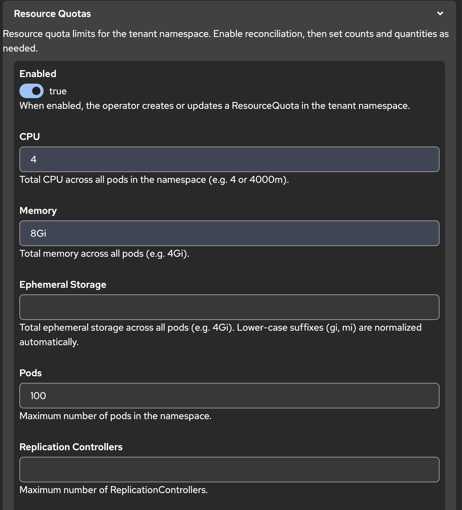

# OpenShift install (OLM CLI)

Install the operator via OLM on OpenShift 4.x using `operator-sdk run bundle`. The operator runs in **`project-onboarding-operator`**.

`ProjectOnboarding` and `TShirtSize` are **cluster-scoped** CRs. `spec.namespaces[].name` is the **tenant** namespace the operator creates (for example `team-alpha-dev`).

For OperatorHub (UI) install, see [operatorhub-install.md](operatorhub-install.md). For **upgrades** (operator-sdk vs marketplace), see [upgrade.md](upgrade.md).

Prerequisites: `oc`, `podman`, `operator-sdk`, cluster-admin, Quay login.

## Step 0 — Cleanup

From the repository root:

```bash
export VERSION="$(tr -d ' \n\r' < VERSION)"

oc delete -k config/samples/ --ignore-not-found
# Offboard sample tenants before deleting ProjectOnboarding (see guide.md — Lifecycle)
oc edit pob team-alpha   # set offboard: true on each spec.namespaces[] entry, save
oc wait --for=delete namespace/team-alpha-dev --timeout=5m 2>/dev/null || true
oc delete projectonboarding --all --ignore-not-found
oc delete tshirtsize --all --ignore-not-found
oc delete namespace team-alpha-dev --ignore-not-found

operator-sdk cleanup project-onboarding-operator -n project-onboarding-operator 2>/dev/null || true
oc delete subscription,installplan,catalogsource,operatorgroup -n project-onboarding-operator --all --ignore-not-found
oc delete csv -l operators.coreos.com/project-onboarding-operator -n project-onboarding-operator --ignore-not-found

make undeploy uninstall 2>/dev/null || true
oc delete project project-onboarding-operator --ignore-not-found
```

## Step 1 — Login

```bash
oc login <api-url> --token=<token>
```

## Step 2 — Variables

From the repository root:

```bash
export VERSION="$(tr -d ' \n\r' < VERSION)"
export CONTAINER_TOOL=podman
export IMG=quay.io/tjungbau/project-onboarding-operator:v${VERSION}
export BUNDLE_IMG=quay.io/tjungbau/project-onboarding-operator-bundle:v${VERSION}
```

Or build and push everything with the release script:

```bash
./scripts/release-openshift.sh "${VERSION}"
```

## Step 3 — Build and push images (manual)

From the repository root:

```bash
podman login quay.io
podman build --platform=linux/amd64 -t $IMG .
podman push $IMG

make bundle IMG=$IMG
make bundle-build BUNDLE_IMG=$BUNDLE_IMG
make bundle-push BUNDLE_IMG=$BUNDLE_IMG
```

The bundle includes an OpenShift SCC binding (`nonroot-v2`) for the hardened image (UID 65532). No manual `oc adm policy` step is required.

## Step 4 — Install operator (cluster-wide)

```bash
oc new-project project-onboarding-operator

operator-sdk run bundle $BUNDLE_IMG \
  --namespace project-onboarding-operator \
  --install-mode AllNamespaces \
  --timeout 10m
```

## Step 5 — Verify operator

```bash
oc get csv -n project-onboarding-operator
oc get deploy,pods -n project-onboarding-operator -l control-plane=controller-manager
```

Expected:

- CSV phase **Succeeded**
- Deployment **3/3** ready (HA; leader election enabled)
- Pods **Running** on channel **`stable`**

## Step 6 — Apply sample CRs

`ProjectOnboarding` is cluster-scoped — do **not** pass `-n` to `oc get projectonboarding`.

From the repository root:

```bash
oc apply -f config/samples/onboarding_v1beta1_tshirtsizes_catalog.yaml
oc apply -k config/samples/

oc get projectonboarding,tshirtsize
oc get namespace team-alpha-dev
oc get resourcequota,limitrange,networkpolicy -n team-alpha-dev
```

Optional cluster GitOps defaults: [cluster-defaults.md](cluster-defaults.md).

## Resource quotas (console form)

After install, create or edit a `ProjectOnboarding` in the console (**Operators → Installed Operators → Project Onboarding**). Under each namespace entry, expand **Resource Quotas** to set tenant limits. Enable reconciliation, then fill in the fields you need (CPU, memory, pods, and so on).



Example namespace entry with inline quotas:

```yaml
spec:
  namespaces:
    - name: team-alpha-dev
      enabled: true
      resourceQuotas:
        enabled: true
        cpu: '4'
        memory: 8Gi
        pods: 100
```

The operator creates a `ResourceQuota` named `<tenant-ns>-quota` in the tenant namespace. For the full field list (limits, requests, storage classes), see [guide.md — Resource quotas](guide.md#resource-quotas).

## Upgrade to a new version

See **[upgrade.md](upgrade.md)** for the full guide (operator-sdk `run bundle` vs OperatorHub / marketplace catalog).

**operator-sdk install** (catalog in `project-onboarding-operator`):

```bash
./scripts/upgrade-cluster.sh "$(tr -d ' \n\r' < VERSION)"
```

**OperatorHub** (catalog in `openshift-marketplace`): patch catalog image, then subscription — details in [upgrade.md](upgrade.md#path-b-operatorhub--marketplace-catalog).

**Publish images and upgrade** (maintainers):

```bash
UPGRADE=true ./scripts/release-openshift.sh "$(tr -d ' \n\r' < VERSION)"
```

**Cluster upgrade only** (images already on Quay):

```bash
./scripts/upgrade-cluster.sh "$(tr -d ' \n\r' < VERSION)"
```

If the subscription stays on an old CSV after a catalog update, see [upgrade.md](upgrade.md#stuck-upgrades) and [operatorhub-install.md — Stuck or failed upgrade](operatorhub-install.md#stuck-or-failed-upgrade).

## Uninstall

From the repository root:

```bash
oc delete -k config/samples/ --ignore-not-found
```

**Offboard tenants before deleting the CR** (`offboard: true` per namespace entry). Without that, `oc delete projectonboarding` leaves objects in `Terminating`. [guide.md — Lifecycle](guide.md#lifecycle-enable-freeze-offboard-and-delete).

Example for the sample CR (`team-alpha` / `team-alpha-dev`):

```yaml
offboard: true
```

If deletion is already blocked, you may see:

```text
Message: Cannot delete ProjectOnboarding while managed tenant namespaces still exist. Set offboard=true on each namespace entry or delete the tenant namespaces manually. Pending: team-alpha-dev
```

Then finish teardown:

```bash
oc edit pob team-alpha   # set offboard: true on team-alpha-dev
oc wait --for=delete namespace/team-alpha-dev --timeout=5m
oc delete projectonboarding --all --ignore-not-found
operator-sdk cleanup project-onboarding-operator -n project-onboarding-operator
oc delete project project-onboarding-operator --ignore-not-found
```
